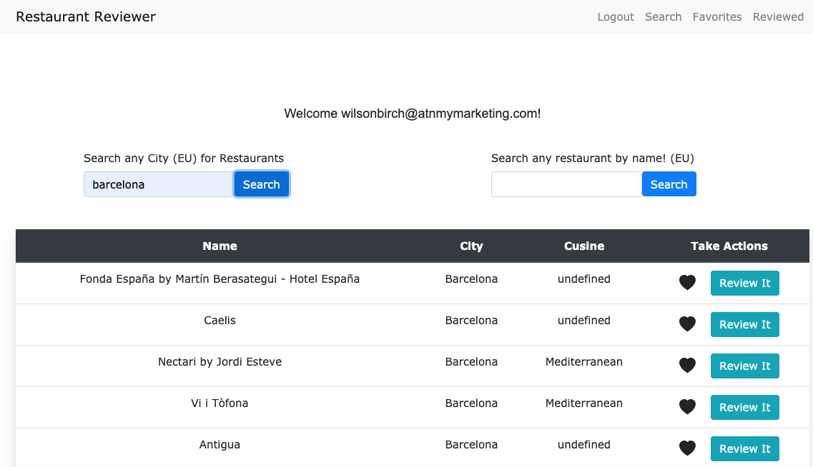

## Restaurant Reviewer

An application that allows you to search, save, review, update and delete new and favourite restaurants all in one place.

## Motivation

An application that allows for the user to search by city or name for any restaurant in Europe. Once the search is completed the user can like or review any option. Each user can see their reviews as well as favorites at anytime.

## Website

Hosted app on heroku can be found here: https://secure-mesa-11479.herokuapp.com/

## Getting Started

1. Navigate to the website with the hosted application above.
2. Sign up (uses passport authentication) for an account or log in if you have already. Remember your password!
3. Use search functionality by name or city (EU)
4. Like or review whichever restaurant you'd like.
5. Use the favorites page to see which you've favorited, click the heart to unfavorite any you no longer want to have saved.
6. Use the reviewed page to see all your reviews!

## Prerequisites

Nothing! Browser based application

To contribute:

1. git clone using ssh key
2. npm install to download necessary packages
3. git branch desired branch name
4. git checkout desired branch name
5. code away and submit a PR

## Screenshots

## Built With

HTML
JS
Handlebars
ESLint
TravisCI
bcryptjs
express
mySQL
passport
sequalize
prettier
chai

## Author(s)

Lankesh De Silva (lankesh16)
Afnan Shaikh (TheShaikh95)
Wilson Birch (wilsonbirch)

## License

## Acknowlegments

TheFork API: https://www.programmableweb.com/api/unofficial-fork
